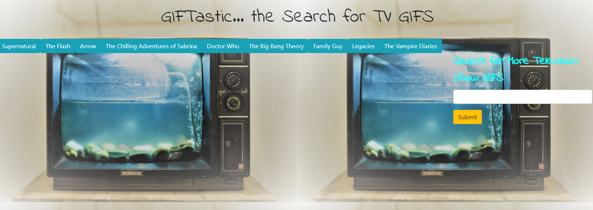

 https://amyhaerr.github.io/GifTastic/

# GifTastic (television shows)
Week 6 assignment of Vanderbilt Coding Bootcamp

## Objective: 
To use the Giphy API to make a dynamic web page that populates with gifs of television shows. To finish the work, one must call the Giphy API and use JavaScript and jQuery to change the HTML of the site.

## Author:
Amy Haerr

## Collaborated with:
1. John Pendergrass
2. Kortnie Heidel

